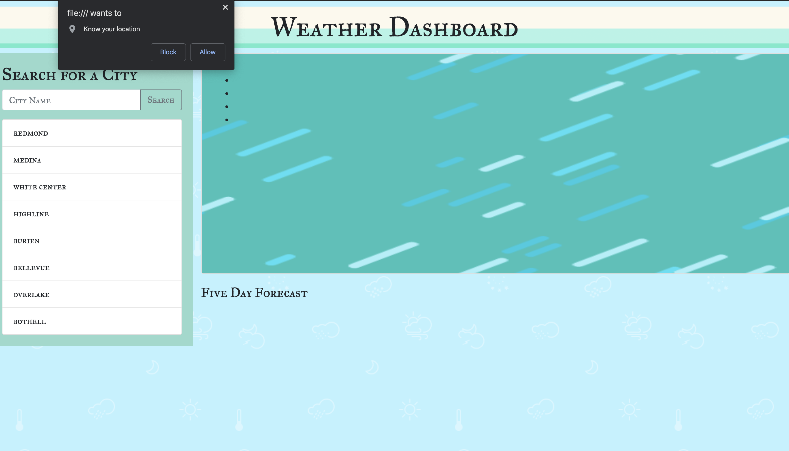
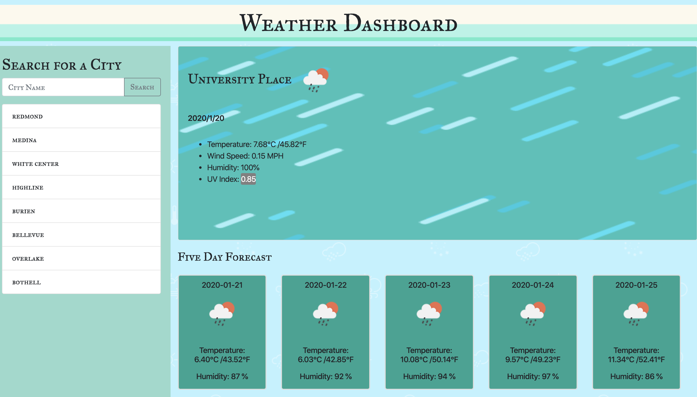

# Weather-Forecast-Application
[Weather-Forecast-Application!](https://yzhao322.github.io/Hope-it-doesn-t-snow-weatherforecast/Hope-it-doesn-t-snow-weatherforecast.html) -https://yzhao322.github.io/Hope-it-doesn-t-snow-weatherforecast/Hope-it-doesn-t-snow-weatherforecast.html

* This Weather Forecast Application use the OpenWeather API to help user to get the weather data in five days for cities. 
* loading page will ask permisson to get the location information, click Allow to get the current location weather data ( including current temp, wind speed, humidity and UV index). 
* At second row on the right will show temperature and humidity in five days.
* Searched history will list on the page left and upload to the LocalStorage. 
* Click on the city name will perform a new search that returns current and future conditions for that city.
